# DiskUltimate

**English** · [Türkçe](README.tr.md)

A visual disk management tool in the spirit of DiskGenius. It works on disk
images, virtual disks and **the real disks in your computer**: partitioning,
formatting, file access, backup, cloning, boot management and data recovery.
Written in Python 3 + PyQt5; every partition table and file system is
implemented **from scratch in pure Python**, so it needs no external tools.


[](https://github.com/mcansiz/DiskUltimate/actions/workflows/ci.yml)

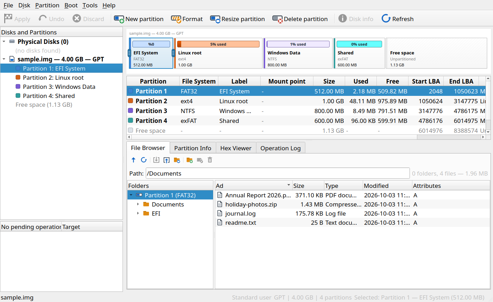

> [!WARNING]
> **This is a beta release.** DiskUltimate writes to disks. Every destructive
> step is queued and confirmed before it runs, but a beta can still have bugs:
> **back up important data first**, and try new operations on a disk image
> before using them on a real disk.

## Contents

- [Download and install](#download-and-install)
- [Features](#features)
- [Supported file systems](#supported-file-systems)
- [Screenshots](#screenshots)
- [Usage](#usage)
- [Safety](#safety)
- [Known limitations](#known-limitations)
- [Building and testing](#building-and-testing)
- [License](#license)

## Download and install

### Windows

Download **`DiskUltimate.exe`** from the
[Releases](../../releases) page. It is a single portable file — no
installation, no Python needed.

- At start-up the app asks for administrator rights (UAC). Physical disks need
  them; if you decline, the app still opens and works with disk images.
- The exe is not code-signed, so Windows SmartScreen may show
  *"Windows protected your PC"*. Choose **More info → Run anyway**.

### Linux (AppImage)

Download **`DiskUltimate-<version>-x86_64.AppImage`** from the
[Releases](../../releases) page, make it executable and run it — nothing to
install, Python and Qt are inside:

```bash
chmod +x DiskUltimate-*-x86_64.AppImage
./DiskUltimate-*-x86_64.AppImage
```

- Works on 64-bit distributions with glibc 2.17 or newer (practically every
  desktop distribution since 2014). On musl systems (Alpine, Void-musl) run
  from source instead.
- It uses the X11/xcb libraries every desktop already has. On a minimal
  install, if it does not start: `sudo apt install libxcb-xinerama0
  libxcb-icccm4 libxcb-image0 libxcb-keysyms1 libxcb-render-util0
  libxkbcommon-x11-0`.
- Without FUSE: `./DiskUltimate-*-x86_64.AppImage --appimage-extract-and-run`.
- Root is requested through `pkexec` at start-up, as below.

### Linux (run from source)

Running from source takes a minute and only needs Python 3.8+ and PyQt5:

```bash
git clone https://github.com/mcansiz/DiskUltimate.git
cd DiskUltimate

# install PyQt5 — pick the line for your distribution
sudo apt install python3-pyqt5        # Debian / Ubuntu / Mint
sudo dnf install python3-qt5          # Fedora
sudo pacman -S python-pyqt5           # Arch / Manjaro
# or: python3 -m pip install -r requirements.txt

python3 main.py
```

At start-up the app asks for root through `pkexec` (needed for physical disks).
If you cancel, it opens as a normal user and works with disk images.
Start with `--no-root` to skip the question.

Optional (Linux): if `mkfs.*` tools are installed they are used for
formatting; otherwise the built-in pure-Python formatter is used.

```bash
sudo apt install dosfstools exfatprogs ntfs-3g e2fsprogs xfsprogs   # optional
```

### macOS (experimental)

Releases include an unsigned `DiskUltimate-<version>-macos-arm64.zip`
(Apple Silicon, macOS 11+). The automated tests pass on macOS 14 in GitHub
Actions, but the app has **not been tried by hand on a Mac** and physical-disk
access on macOS is untested, so macOS is not officially supported. First
start: right-click the app → **Open**.

## Features

### Disks and images
- **Physical disks** — every attached disk is listed with model, size, bus and
  partitions; USB sticks and SD cards appear **automatically** when plugged in
  while the app is running
- Several disks and images open at the same time, side by side in the tree
- Disk images: `.img` / `.raw` / `.dd` (created as sparse files), resizable
- Virtual disks: **VHD** (fixed and dynamic — read, write, create),
  **VMDK** (read; flat VMDK also write), **VDI** and **QCOW2** (read)
- Disks without a partition table (a whole-disk file system, an `.iso`) open too

### Partitions
- **MBR** (4 primary + extended + logical) and **GPT** (128 entries, CRC32,
  backup header, protective MBR)
- **MBR ↔ GPT conversion without data loss** — partition data stays in place;
  a pre-check tells you if a conversion is not possible
- Create, delete, format; change partition type, GPT name, volume label and
  boot (active) flag
- **Resize and move with the mouse** — drag the handles on the partition bar;
  data is preserved for FAT12/16/32, exFAT, NTFS and ext2/3/4 (shrink, grow,
  move) and XFS (grow), all in pure Python on every platform
- Shrinking below the space the files need is **refused**, whatever you confirm
- Partition layout editor for changing size and position of a partition in one step
- 4K alignment check
- Mount / unmount (Linux), assign / remove drive letter (Windows)

### Pending operations and one "Apply"
- Destructive steps are **not written immediately**: they go into a queue
- The main screen shows the **planned layout** — new partitions appear,
  deleted ones disappear — and you can switch back to the on-disk layout
- **Undo** removes the last step, **Discard** cancels them all
- **Apply** lists every step, counts the ones that destroy data, and runs them
  in order with a progress bar per step

### File access
- File browser with folder tree: list, preview (text and hex), export files and
  folders, import files, create folders, delete, rename
- Long file names (FAT LFN, exFAT/NTFS UTF-16)
- Read **and write** on FAT, exFAT, NTFS, ext2/3/4, HFS+ and UDF — see the
  [file system table](#supported-file-systems)

### Backup and cloning
- Own backup format **`.dub`** — compressed, skips empty blocks (a 400 MB empty
  partition becomes a 34 KB backup); each backup can carry a note
- **Open a backup without restoring it** — browse partitions, folders and files
  read-only and export what you need
- Restore a disk or partition to an open disk, a new image file or a
  **physical disk**
- **Clone** a disk to an image file or **directly to another disk** (on a
  larger target the GPT backup header is moved to the end); clone a partition
  to another partition; sparse regions are preserved
- Create a new VHD virtual disk

### Boot management
- **Boot loader manager** — shows the operating systems on a disk and its boot
  code (GRUB 2, GRUB Legacy, Windows, SYSLINUX, LILO); works on every platform
  and on image files, without mounting
- **Remove boot code** — clears the first 440 bytes, keeps the partition table and files
- **GRUB management (Linux)** — install, regenerate the boot menu, toggle
  `os-prober`, back up / restore settings, one-click repair
- **UEFI boot editor** — list firmware boot entries, change the order, enable
  or disable entries, rename, delete, set *next boot* and the menu timeout.
  Nothing is written until you confirm; a **backup is taken first**.
  Entries can be exported to / imported from a file

### Data recovery
- **Deleted file recovery** on FAT (including long names) and exFAT, with a
  recoverability estimate for each file
- **Lost partition scan** (quick and deep) — FAT, exFAT, NTFS, ext2/3/4, XFS,
  btrfs, HFS+, APFS, F2FS, ReFS and Linux swap; found partitions can be added
  back to the table
- **File carving** by signature: JPEG, PNG, GIF, PDF, ZIP/Office, RAR, 7z,
  GZIP, MP3, MP4, EXE, ELF, SQLite

### NTFS check and repair
- When Windows is shut down with **Fast Startup**, hibernates or loses power,
  its NTFS partitions are left "not cleanly unmounted" and **Linux refuses to
  mount them** — the classic fix is `sudo ntfsfix -d /dev/…` in a terminal
- *Partition → Check and repair NTFS…* does the same job on every platform:
  shows what is wrong (dirty flag, unclean `$LogFile`, `$MFTMirr` mismatch,
  damaged boot sector or backup, hibernated Windows), then repairs it as a
  queued step — boot sector from its backup, `$MFT` ↔ `$MFTMirr`, empties the
  journal, clears the dirty flag (or asks Windows to run chkdsk instead)
- A hibernated Windows is detected and the repair is refused unless you
  explicitly choose to invalidate the hibernation file — writing to a
  hibernated volume and resuming Windows would corrupt it
- The partition info panel shows the state of every NTFS partition, and a
  failed mount on Linux offers the check directly

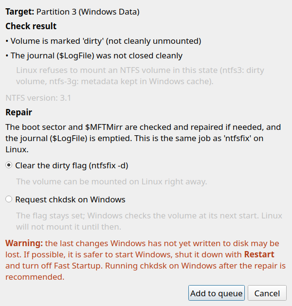

### Maintenance
- **Secure wipe** of a disk or partition: zero fill, random, DoD 3-pass,
  DoD 7-pass, with optional verification
- **Free space wipe** — destroys leftover data without touching existing files
- Sector hex viewer
- Operation log, system information, built-in diagnostics (the app writes a
  report by itself if the interface stops responding)

### Interface
- **Ten languages**: English, Turkish, German, French, Italian, Spanish,
  Russian, Simplified Chinese, Japanese and Korean, switched live from
  *Tools → Language* (no restart; open disks and pending steps are kept).
  The French, Italian, Spanish, Russian, Chinese, Japanese and Korean
  translations are new in this version and have not yet been reviewed by
  native speakers — corrections are welcome
- **Update check**: on start-up the app checks GitHub for a newer release in the
  background and offers to open the download page (*Help → Check for updates*;
  can be turned off, or set `DISKULTIMATE_UPDATE_CHECK=0`)
- **Installed operating system per partition**: Windows version (e.g. Windows 11),
  Linux distribution, macOS version, and which systems an EFI partition boots,
  shown in the tree, the partition table and the disk map
- Several icon sets (built-in, Tabler, Lucide, Material, Phosphor, Bootstrap)
- **System, Light and Dark themes** (*Tools → Theme*); System follows your desktop's Qt theme

## Supported file systems

| File system | Format | Read | Write | Notes |
|---|:---:|:---:|:---:|---|
| FAT12 / FAT16 / FAT32 | ✅ | ✅ | ✅ | checked with `fsck.vfat` |
| exFAT | ✅ | ✅ | ✅ | checked with `fsck.exfat` |
| NTFS | ✅ | ✅ | ✅ | checked with `chkdsk` and `ntfs-3g`; compressed/encrypted streams not supported |
| ext2 / ext3 / ext4 | ✅ | ✅ | ✅ | `metadata_csum`, extents, htree; `bigalloc`/`inline_data` refused for writing |
| HFS+ / HFSX | ✅ | ✅ | ✅ | checked with `fsck.hfsplus` |
| UDF | ✅ | ✅ | ✅ | verified both ways with Windows |
| XFS | ✅ | ✅ | — | grow supported; checked with `xfs_repair` |
| btrfs | — | ✅ | — | zlib / LZO / zstd decompression |
| F2FS | — | ✅ | — | |
| APFS | — | ✅ | — | unencrypted volumes only |
| ISO 9660 | — | ✅ | — | Joliet and Rock Ridge |
| ReFS | ✅* | — | — | *Windows' own tool only (Enterprise, Pro for Workstations, Server) |

**Recognised only** (shown with name and colour, content not read):
BitLocker, LUKS1/2, LVM2, Linux RAID, ZFS, Linux swap, CoreStorage, JFS,
ReiserFS, bcachefs, NILFS2, EROFS, SquashFS, Minix.

When an option cannot be used on your system, the format dialog does not hide
it — it shows it greyed out with the **reason**.

## Screenshots

| | |
|---|---|
| 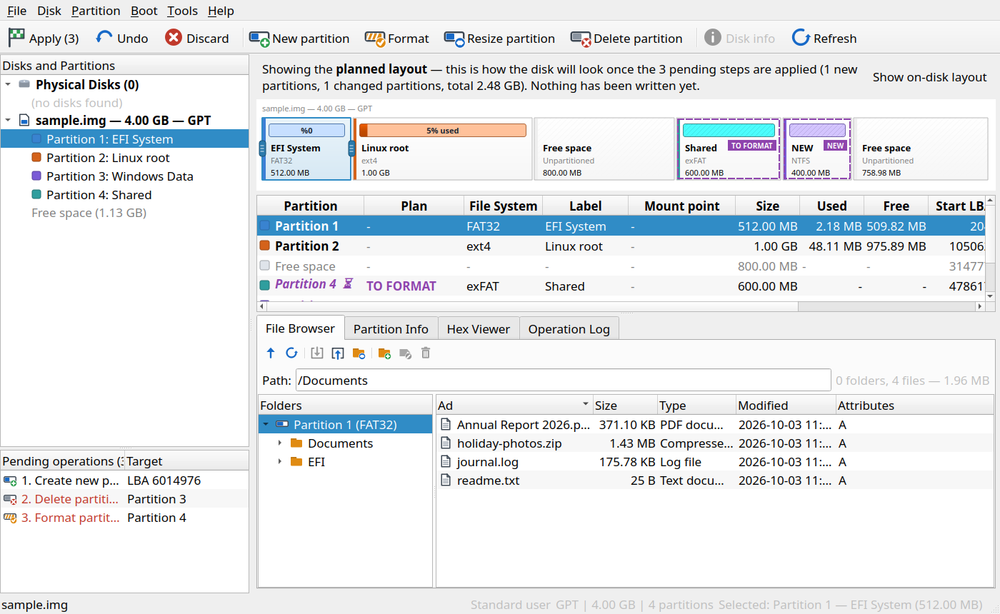 | 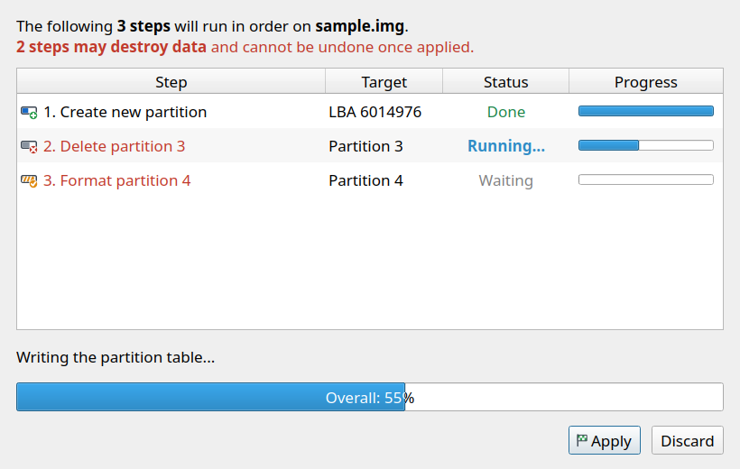 |
| Pending steps are drawn on the map before anything is written | *Apply* runs the steps in order, each with its own progress |
| 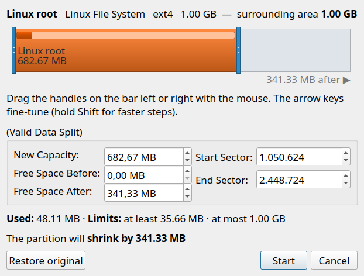 | 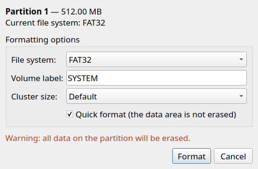 |
| Resize and move by dragging | Format dialog |
| 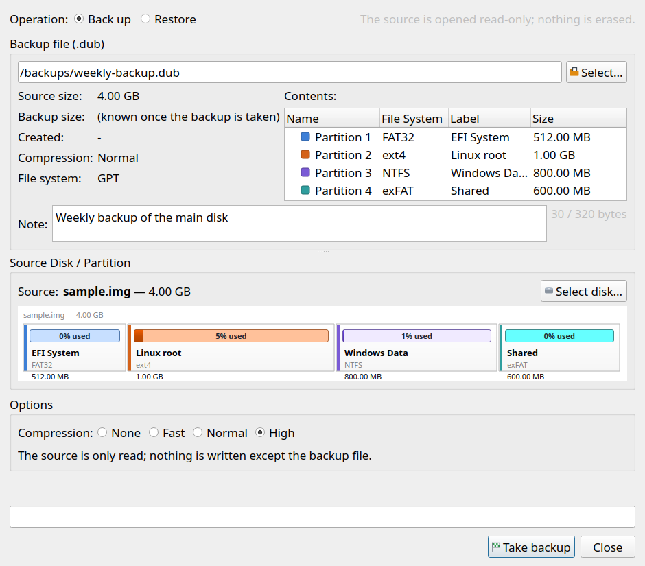 | 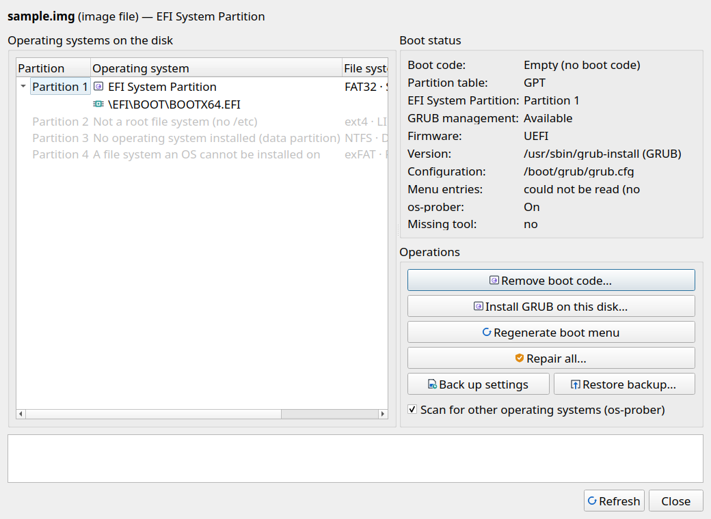 |
| Backup and restore in one window | Boot loader manager |
| 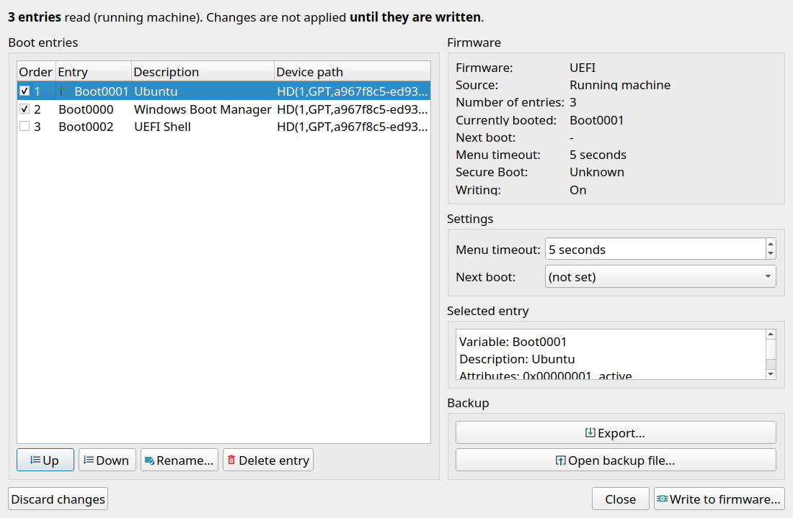 | 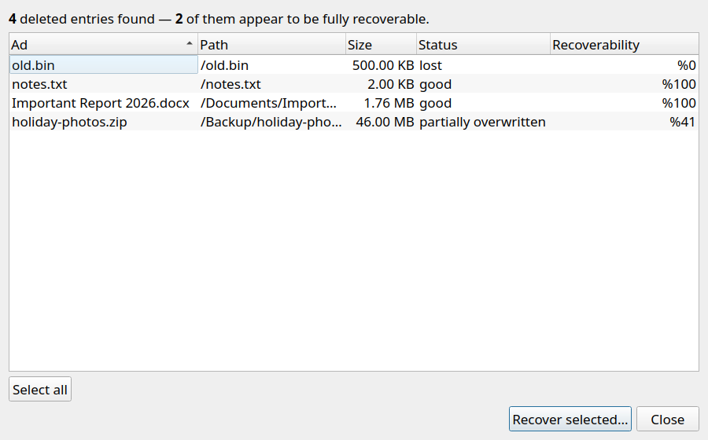 |
| UEFI boot editor | Deleted file recovery |
| 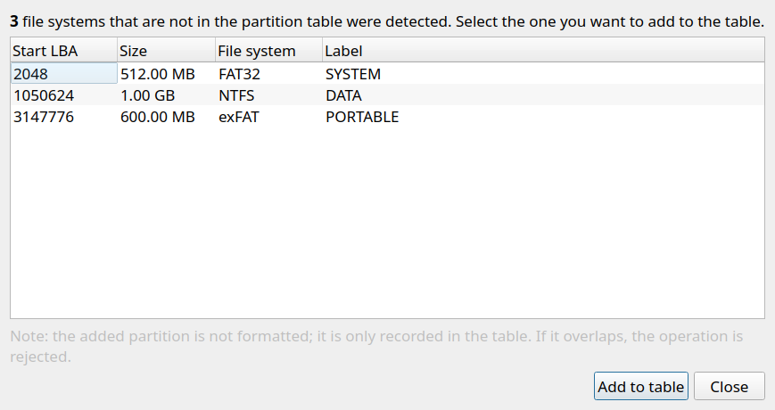 | 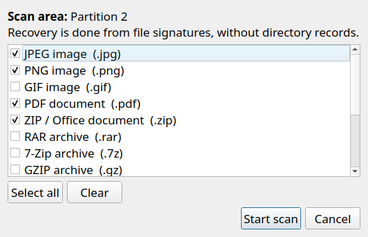 |
| Lost partition scan | Signature-based file recovery |
| 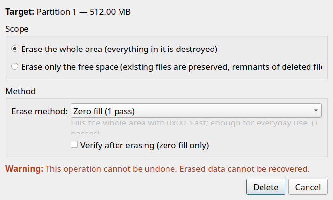 | 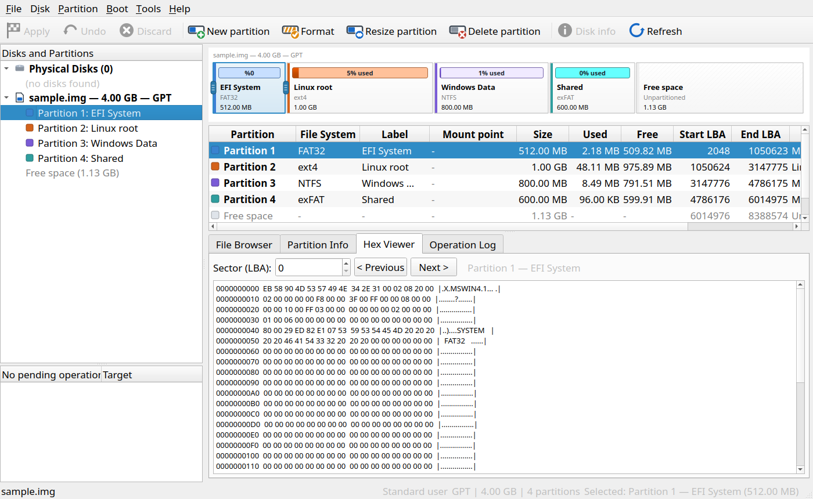 |
| Secure wipe | Sector hex viewer |

## Usage

```bash
python3 main.py                  # start empty
python3 main.py disk.img         # open an image at start-up
python3 main.py --no-root        # do not ask for root / administrator rights
DISKULTIMATE_LANG=en python3 main.py   # force a language (tr, en, de, fr, it, es, ru, zh, ja, ko)
DISKULTIMATE_THEME=dark python3 main.py  # force a theme (system, light, dark)
```

The same options work with `DiskUltimate.exe`.

**A typical session:** *File → New image…* (choose size and partition table) →
right-click the free space on the map → *New partition…* → choose a file
system → add files from the *File Browser* tab → **Apply**.

**Language at start-up:** `DISKULTIMATE_LANG` → the saved choice → the
operating system's language → Turkish.

**Windows partition does not mount on Linux?** Windows most likely left it
"dirty" (Fast Startup is on by default). Select the partition and use
*Partition → Check and repair NTFS…*, then **Apply**. To stop it happening
again, turn off Fast Startup in Windows (*Control Panel → Power Options →
Choose what the power buttons do*) or shut Windows down with **Restart**.

**Wayland:** Qt 5's native Wayland plugin draws modal windows empty, so on
Wayland sessions the app starts on XWayland (`xcb`) automatically. To force
native Wayland: `DISKULTIMATE_QPA=wayland python3 main.py`.

## Safety

Access to physical disks goes through six layers, and none of them is relaxed:

1. **Listing is harmless** — listing disks reads no sectors and writes nothing.
2. **Read-only by default** — a disk is always opened read-only; write access
   is taken only while pending steps are being applied.
3. **System disk** — writing to the disk the running system lives on requires
   typing the disk's name to confirm.
4. **Incomplete information** (for example, no permission to read it) — writing
   is **refused**; "unknown" is never presented as "safe".
5. **Mounted partitions** — you are warned before anything is written.
6. Every new destructive operation is **tested** against these layers.

A failed format restores the old partition table. Disk images never need
administrator rights.

## Known limitations

- **Beta:** operations on real disks have been tested on Windows and Linux
  test machines, but not on every hardware and configuration.
- macOS is not tested and not supported.
- The hex viewer is read-only (no sector editing).
- Not available: splitting / merging partitions, primary ↔ logical
  conversion, bad sector scan, S.M.A.R.T., dynamic disks, RAID recovery.
- Deleted file recovery works on FAT and exFAT; on other file systems use
  file carving.

## Building and testing

Build a single-file executable with PyInstaller (all settings are in
`DiskUltimate.spec`):

```bat
build_exe.bat        :: Windows → dist\DiskUltimate.exe
```
```bash
./build_appimage.sh  # Linux → dist/DiskUltimate-<version>-x86_64.AppImage
```

The AppImage is built from a portable Python (manylinux2014, glibc 2.17) and
the PyPI PyQt5 wheels, so the result does not depend on the build machine's
glibc; the tool prints the highest glibc version the package needs.
`./build_linux.sh` still builds a single-file PyInstaller binary, but that one
only runs on systems with the same or a newer glibc than the build machine.

Tests run on disk image files only (nothing touches your real disks):

```bash
python3 -m tests.run_all          # core tests
python3 -m tests.platform_check   # cross-platform rules
python3 -m tests.i18n_check       # translation catalogs
python3 -m tests.diag_check       # diagnostics / freeze detector
python3 -m tests.ui_smoke         # interface smoke test
```

Volumes written by the app are cross-checked with independent tools
(`fsck.vfat`, `fsck.exfat`, `e2fsck`, `ntfsfix`, `xfs_repair`, `fsck.hfsplus`,
Windows `chkdsk`). Translations live in `src/diskultimate/i18n/catalogs/*.ts` (Qt Linguist
format) and can be edited with Qt Linguist.

The README screenshots are regenerated with `python3 tools/readme_screenshots.py`.

## License

[GNU General Public License v3.0](LICENSE) — you may use, modify and
distribute this software; derived works must stay open source under the same
license. The downloadable builds include Qt (LGPL-3.0), PyQt5 (GPL-3.0),
PyQt5-sip (BSD-2-Clause), Python (PSF) and several icon sets; their licenses
and notices are listed under *Help → Third-party licenses*
(`src/diskultimate/licenses/`).

Developed by **Mikail Cansız** — https://github.com/mcansiz/DiskUltimate
