# DiskUltimate

[English](README.md) · **Türkçe**

DiskGenius benzeri görsel disk yönetim aracı. Disk görüntüleri, sanal diskler
ve **bilgisayarınızdaki gerçek diskler** üzerinde çalışır: bölümleme,
biçimlendirme, dosya erişimi, yedekleme, klonlama, önyükleme yönetimi ve veri
kurtarma. Python 3 + PyQt5 ile yazılmıştır; bütün bölüm tabloları ve dosya
sistemleri **sıfırdan, saf Python ile** yazıldığı için harici araç gerekmez.


[](https://github.com/mcansiz/DiskUltimate/actions/workflows/ci.yml)

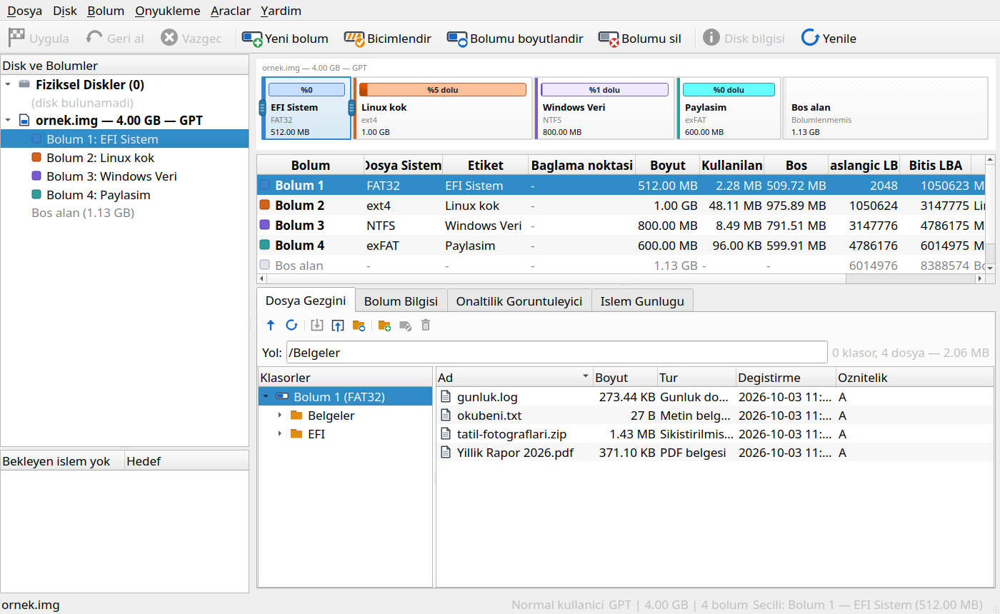

> [!WARNING]
> **Bu bir beta sürümüdür.** DiskUltimate diske yazar. Yıkıcı her adım
> kuyruğa girer ve çalışmadan önce onaylanır; yine de beta sürümde hata
> olabilir: **önemli verilerinizi önce yedekleyin** ve yeni bir işlemi gerçek
> diskte kullanmadan önce bir disk görüntüsü üzerinde deneyin.

## İçindekiler

- [İndirme ve kurulum](#i̇ndirme-ve-kurulum)
- [Özellikler](#özellikler)
- [Desteklenen dosya sistemleri](#desteklenen-dosya-sistemleri)
- [Ekran görüntüleri](#ekran-görüntüleri)
- [Kullanım](#kullanım)
- [Güvenlik](#güvenlik)
- [Bilinen sınırlar](#bilinen-sınırlar)
- [Derleme ve test](#derleme-ve-test)
- [Lisans](#lisans)

## İndirme ve kurulum

### Windows

[Releases](../../releases) sayfasından **`DiskUltimate.exe`** dosyasını
indirin. Tek, taşınabilir bir dosyadır — kurulum ve Python gerekmez.

- Açılışta yönetici yetkisi ister (UAC). Fiziksel diskler için gereklidir;
  reddederseniz uygulama yine açılır ve disk görüntüleriyle çalışır.
- Exe kod imzalı değildir; Windows SmartScreen *"Windows bilgisayarınızı
  korudu"* uyarısı gösterebilir. **Ek bilgi → Yine de çalıştır** seçin.

### Linux (AppImage)

[Releases](../../releases) sayfasından **`DiskUltimate-<sürüm>-x86_64.AppImage`**
dosyasını indirin, çalıştırılabilir yapın ve açın — kurulum gerekmez, Python ve
Qt içindedir:

```bash
chmod +x DiskUltimate-*-x86_64.AppImage
./DiskUltimate-*-x86_64.AppImage
```

- glibc 2.17 ve sonrası olan 64 bit dağıtımlarda çalışır (2014'ten beri
  neredeyse bütün masaüstü dağıtımları). musl sistemlerde (Alpine, Void-musl)
  kaynaktan çalıştırın.
- Her masaüstünde bulunan X11/xcb kütüphanelerini kullanır. En küçük
  kurulumlarda açılmazsa: `sudo apt install libxcb-xinerama0 libxcb-icccm4
  libxcb-image0 libxcb-keysyms1 libxcb-render-util0 libxkbcommon-x11-0`.
- FUSE yoksa: `./DiskUltimate-*-x86_64.AppImage --appimage-extract-and-run`.
- Root yetkisi açılışta `pkexec` ile istenir (aşağıdaki gibi).

### Linux (kaynaktan çalıştırma)

Kaynaktan çalıştırmak bir dakika sürer ve yalnızca Python 3.8+ ile PyQt5
gerekir:

```bash
git clone https://github.com/mcansiz/DiskUltimate.git
cd DiskUltimate

# PyQt5 kurulumu — dağıtımınıza uygun satırı seçin
sudo apt install python3-pyqt5        # Debian / Ubuntu / Mint
sudo dnf install python3-qt5          # Fedora
sudo pacman -S python-pyqt5           # Arch / Manjaro
# veya: python3 -m pip install -r requirements.txt

python3 main.py
```

Uygulama açılışta `pkexec` ile root yetkisi ister (fiziksel diskler için
gerekir). İptal ederseniz normal kullanıcı olarak açılır ve disk görüntüleriyle
çalışır. Soruyu atlamak için `--no-root` ile başlatın.

İsteğe bağlı (Linux): `mkfs.*` araçları kuruluysa biçimlendirmede onlar
kullanılır; yoksa yerleşik saf Python biçimlendirici devreye girer.

```bash
sudo apt install dosfstools exfatprogs ntfs-3g e2fsprogs xfsprogs   # isteğe bağlı
```

### macOS (deneysel)

Sürümlerde imzasız bir `DiskUltimate-<sürüm>-macos-arm64.zip` bulunur (Apple
Silicon, macOS 11+). Otomatik testler GitHub Actions'ta macOS 14 üzerinde
geçiyor; ancak uygulama bir Mac'te **elle denenmedi** ve macOS'ta fiziksel disk
erişimi sınanmadı, bu yüzden resmi olarak desteklenmiyor. İlk açılış: uygulamaya
sağ tık → **Aç**.

## Özellikler

### Diskler ve görüntüler
- **Fiziksel diskler** — takılı her disk model, boyut, veri yolu ve bölümleriyle
  listelenir; USB bellek ve SD kart uygulama açıkken takılsa da listede
  **kendiliğinden** belirir
- Birden fazla disk ve görüntü aynı anda açılır, ağaçta alt alta durur
- Disk görüntüleri: `.img` / `.raw` / `.dd` (seyrek dosya olarak oluşturulur),
  boyutu değiştirilebilir
- Sanal diskler: **VHD** (sabit ve dinamik — okuma, yazma, oluşturma),
  **VMDK** (okuma; düz VMDK'de yazma), **VDI** ve **QCOW2** (okuma)
- Bölüm tablosu olmayan diskler (tüm diske kurulmuş dosya sistemi, `.iso`) de açılır

### Bölümler
- **MBR** (4 birincil + genişletilmiş + mantıksal) ve **GPT** (128 giriş, CRC32,
  yedek başlık, koruyucu MBR)
- **Veri kaybı olmadan MBR ↔ GPT dönüşümü** — bölüm verileri yerinde kalır;
  dönüşüm mümkün değilse ön denetim bunu söyler
- Bölüm oluşturma, silme, biçimlendirme; bölüm türü, GPT adı, birim etiketi ve
  önyükleme (aktif) bayrağı değiştirme
- **Fareyle boyutlandırma ve taşıma** — bölüm şeridindeki tutamaçları sürükleyin;
  FAT12/16/32, exFAT, NTFS ve ext2/3/4'te (küçültme, büyütme, taşıma) ve XFS'te
  (büyütme) veri korunur — hepsi saf Python, her platformda
- Dosyaların sığmadığı bir boyuta küçültme, hangi onay verilirse verilsin **reddedilir**
- Bölümün boyutunu ve konumunu tek adımda değiştiren bölüm düzeni penceresi
- 4K hizalama denetimi
- Bağlama / ayırma (Linux), sürücü harfi atama / kaldırma (Windows)

### Bekleyen işlemler ve tek "Uygula"
- Yıkıcı adımlar **hemen yazılmaz**, kuyruğa girer
- Ana ekran **planlanan yerleşimi** gösterir — yeni bölüm belirir, silinecek
  olan kalkar; istenirse diskteki hâline dönülür
- **Geri al** son adımı kaldırır, **Vazgeç** hepsini iptal eder
- **Uygula** bütün adımları listeler, veri silenleri sayar ve adımları sırayla,
  her biri kendi ilerleme çubuğuyla çalıştırır

### Dosya erişimi
- Klasör ağaçlı dosya gezgini: listeleme, önizleme (metin ve onaltılık),
  dosya ve klasörleri dışa aktarma, dosya içe aktarma, klasör oluşturma,
  silme, yeniden adlandırma
- Uzun dosya adları (FAT LFN, exFAT/NTFS UTF-16)
- FAT, exFAT, NTFS, ext2/3/4, HFS+ ve UDF'de okuma **ve yazma** —
  [dosya sistemi tablosuna](#desteklenen-dosya-sistemleri) bakın

### Yedekleme ve klonlama
- Kendi yedek biçimi **`.dub`** — sıkıştırılmış, boş blokları atlar (400 MB'lık
  boş bölüm → 34 KB yedek); her yedeğe not eklenebilir
- **Yedeği geri yüklemeden açma** — bölümler, klasörler ve dosyalar salt okunur
  gezilir, gerekenler dışa aktarılır
- Diski veya bölümü açık bir diske, yeni bir görüntü dosyasına ya da
  **fiziksel diske** geri yükleme
- Diski görüntü dosyasına veya **doğrudan başka bir diske klonlama** (büyük
  hedefte GPT yedek başlığı sona taşınır); bölümden bölüme klonlama; seyrek
  alanlar korunur
- Yeni VHD sanal disk oluşturma

### Önyükleme yönetimi
- **Önyükleyici yöneticisi** — diskteki işletim sistemlerini ve önyükleme kodunu
  (GRUB 2, GRUB Legacy, Windows, SYSLINUX, LILO) gösterir; her platformda ve
  görüntü dosyalarında, bağlamadan çalışır
- **Önyükleme kodunu kaldırma** — ilk 440 baytı sıfırlar, bölüm tablosunu ve
  dosyaları korur
- **GRUB yönetimi (Linux)** — kurulum, önyükleme menüsünü yeniden üretme,
  `os-prober`'ı açıp kapatma, ayarları yedekleme / geri yükleme, tek tuşla onarım
- **UEFI önyükleme düzenleyici** — bellenimdeki önyükleme girişlerini listeler;
  sırayı değiştirme, girişi etkinleştirme / devre dışı bırakma, yeniden
  adlandırma, silme, *sonraki önyükleme* ve menü bekleme süresi. Onay
  verilmeden hiçbir şey yazılmaz; yazmadan önce **yedek alınır**. Girişler
  dosyaya aktarılıp dosyadan geri alınabilir

### Veri kurtarma
- FAT (uzun adlar dahil) ve exFAT'ta **silinmiş dosya kurtarma**, her dosya
  için kurtarılabilirlik tahmini
- **Kayıp bölüm tarama** (hızlı ve derin) — FAT, exFAT, NTFS, ext2/3/4, XFS,
  btrfs, HFS+, APFS, F2FS, ReFS ve Linux takas; bulunan bölüm tabloya geri eklenir
- İmza tabanlı **dosya kurtarma (carving)**: JPEG, PNG, GIF, PDF, ZIP/Office,
  RAR, 7z, GZIP, MP3, MP4, EXE, ELF, SQLite

### NTFS denetleme ve onarma
- Windows **Hızlı başlatma** ile kapatıldığında, hazırda bekletmeye girdiğinde
  ya da elektrik kesildiğinde NTFS bölümleri "temiz ayrılmamış" kalır ve
  **Linux onları bağlamayı reddeder** — bilinen çözüm terminalde
  `sudo ntfsfix -d /dev/…` komutudur
- *Bolum → NTFS'i denetle ve onar...* aynı işi her platformda yapar: sorunu
  gösterir (kirli bayrak, temiz kapatılmamış `$LogFile`, `$MFTMirr`
  uyuşmazlığı, bozuk önyükleme sektörü veya yedeği, hazırda bekleyen Windows),
  ardından onarımı kuyruğa ekler — önyükleme sektörünü yedekten geri yazar,
  `$MFT` ↔ `$MFTMirr`'i eşitler, günlüğü boşaltır, kirli bayrağı temizler
  (ya da bunun yerine Windows'tan chkdsk ister)
- Hazırda bekleyen Windows tanınır; hazırda bekletme dosyasını geçersiz
  kılmayı açıkça seçmezseniz onarım reddedilir — hazırda bekleyen bir birime
  yazıp Windows'u kaldığı yerden açmak birimi bozar
- Bölüm bilgisi paneli her NTFS bölümünün durumunu gösterir; Linux'ta
  bağlama başarısız olursa denetim doğrudan önerilir

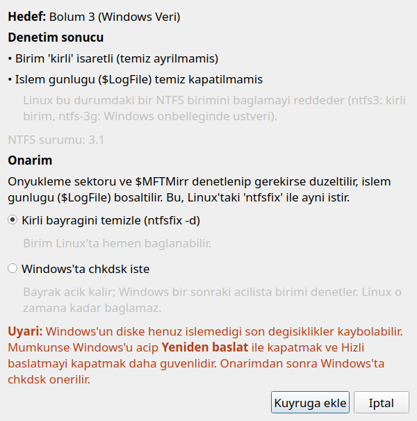

### Bakım
- Disk veya bölüm için **güvenli silme**: sıfır doldurma, rastgele, DoD 3 geçiş,
  DoD 7 geçiş, isteğe bağlı doğrulama
- **Boş alan silme** — mevcut dosyalara dokunmadan artık veriyi yok eder
- Sektör onaltılık görüntüleyici
- İşlem günlüğü, sistem bilgisi, yerleşik tanılama (arayüz yanıt vermezse
  uygulama kendiliğinden rapor yazar)

### Arayüz
- **On dil**: Türkçe, İngilizce, Almanca, Fransızca, İtalyanca, İspanyolca,
  Rusça, Basitleştirilmiş Çince, Japonca ve Korece; *Araclar → Dil*
  menüsünden anında değişir (yeniden başlatma gerekmez, açık diskler ve
  bekleyen adımlar korunur). Fransızca, İtalyanca, İspanyolca, Rusça, Çince,
  Japonca ve Korece çeviriler bu sürümde eklendi ve henüz anadili konuşanlarca
  gözden geçirilmedi — düzeltmeler memnuniyetle karşılanır
- **Güncelleme denetimi**: açılışta GitHub'da daha yeni bir sürüm olup olmadığına
  arka planda bakar ve indirme sayfasını açmayı önerir (*Yardım → Güncellemeleri
  denetle*; kapatılabilir ya da `DISKULTIMATE_UPDATE_CHECK=0`)
- **Bölüm başına kurulu işletim sistemi**: Windows sürümü (ör. Windows 11), Linux
  dağıtımı, macOS sürümü ve EFI bölümünün hangi sistemleri başlattığı; ağaçta,
  bölüm tablosunda ve disk haritasında gösterilir
- Birden fazla ikon seti (yerleşik, Tabler, Lucide, Material, Phosphor, Bootstrap)
- **Sistem, Açık ve Koyu tema** (*Araclar → Tema*); Sistem masaüstünün Qt temasını izler

## Desteklenen dosya sistemleri

| Dosya sistemi | Biçimlendirme | Okuma | Yazma | Not |
|---|:---:|:---:|:---:|---|
| FAT12 / FAT16 / FAT32 | ✅ | ✅ | ✅ | `fsck.vfat` ile doğrulandı |
| exFAT | ✅ | ✅ | ✅ | `fsck.exfat` ile doğrulandı |
| NTFS | ✅ | ✅ | ✅ | `chkdsk` ve `ntfs-3g` ile doğrulandı; sıkıştırılmış/şifreli akış desteklenmez |
| ext2 / ext3 / ext4 | ✅ | ✅ | ✅ | `metadata_csum`, extent, htree; `bigalloc`/`inline_data`'da yazma reddedilir |
| HFS+ / HFSX | ✅ | ✅ | ✅ | `fsck.hfsplus` ile doğrulandı |
| UDF | ✅ | ✅ | ✅ | Windows ile iki yönlü doğrulandı |
| XFS | ✅ | ✅ | — | büyütme desteklenir; `xfs_repair` ile doğrulandı |
| btrfs | — | ✅ | — | zlib / LZO / zstd çözme |
| F2FS | — | ✅ | — | |
| APFS | — | ✅ | — | yalnızca şifresiz birimler |
| ISO 9660 | — | ✅ | — | Joliet ve Rock Ridge |
| ReFS | ✅* | — | — | *yalnızca Windows'un kendi aracıyla (Enterprise, Pro for Workstations, Server) |

**Yalnızca tanınanlar** (adı ve rengiyle gösterilir, içeriği okunmaz):
BitLocker, LUKS1/2, LVM2, Linux RAID, ZFS, Linux takas, CoreStorage, JFS,
ReiserFS, bcachefs, NILFS2, EROFS, SquashFS, Minix.

Sisteminizde kullanılamayan bir seçenek biçimlendirme penceresinde gizlenmez;
gri gösterilir ve yanında **nedeni** yazar.

## Ekran görüntüleri

| | |
|---|---|
| 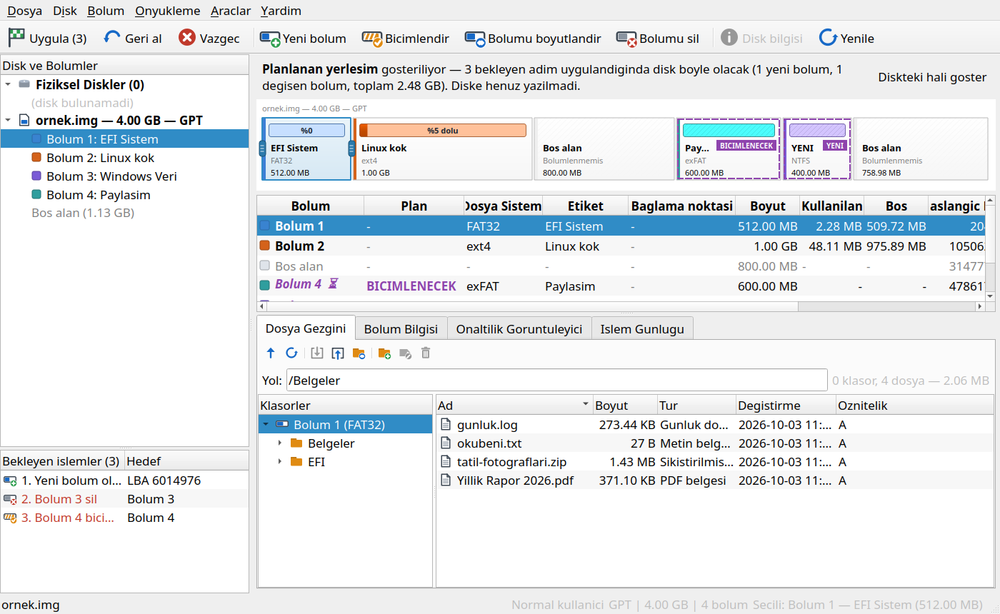 | 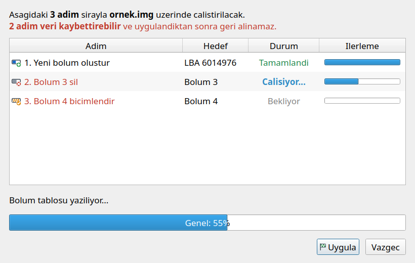 |
| Bekleyen adımlar diske yazılmadan haritada gösterilir | *Uygula* adımları sırayla, her biri kendi ilerlemesiyle çalıştırır |
| 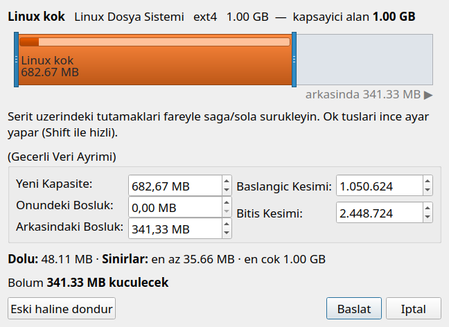 | 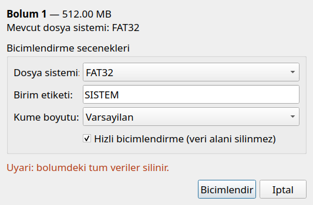 |
| Sürükleyerek boyutlandırma ve taşıma | Biçimlendirme penceresi |
| 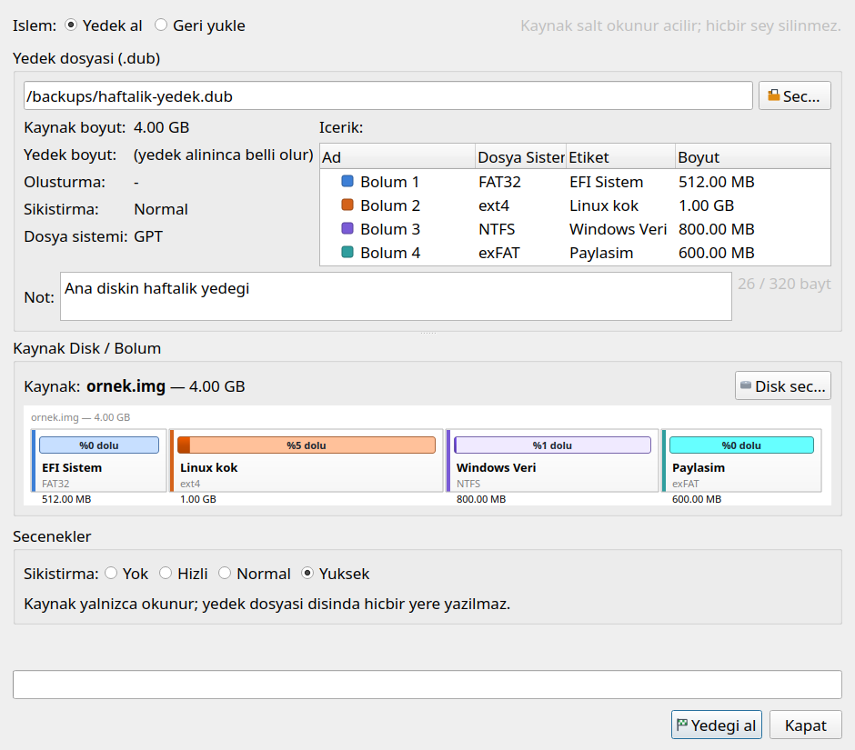 | 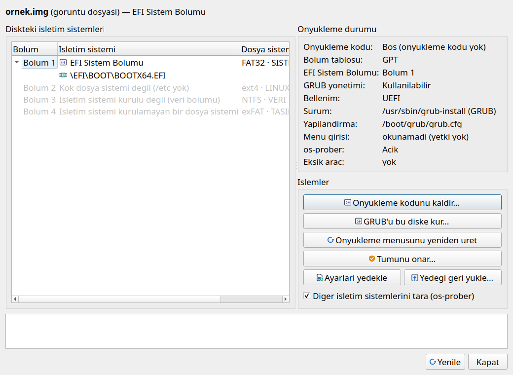 |
| Yedekleme ve geri yükleme tek pencerede | Önyükleyici yöneticisi |
| 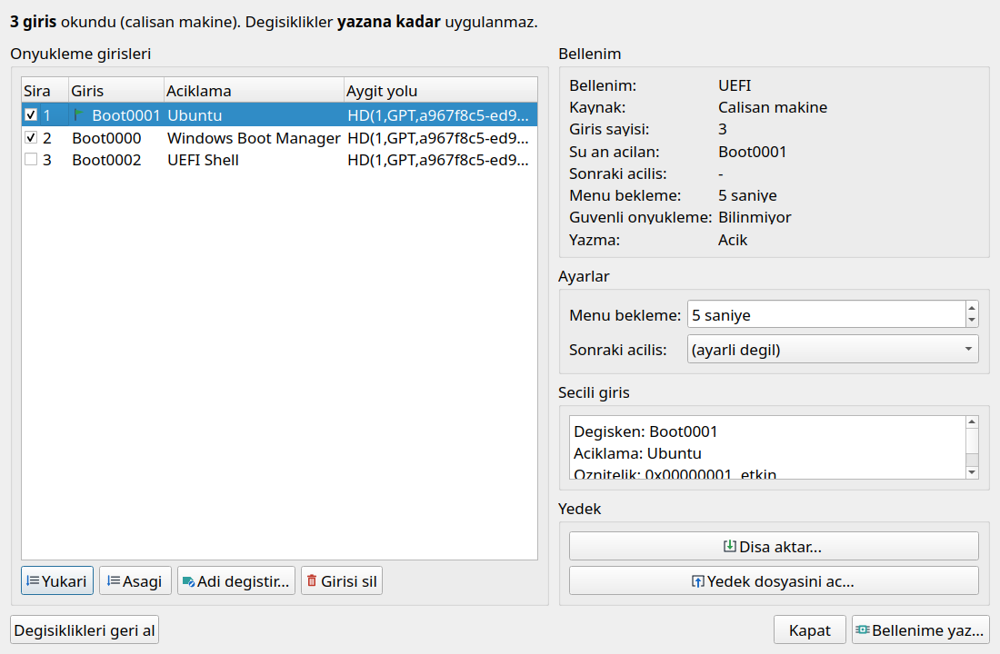 | 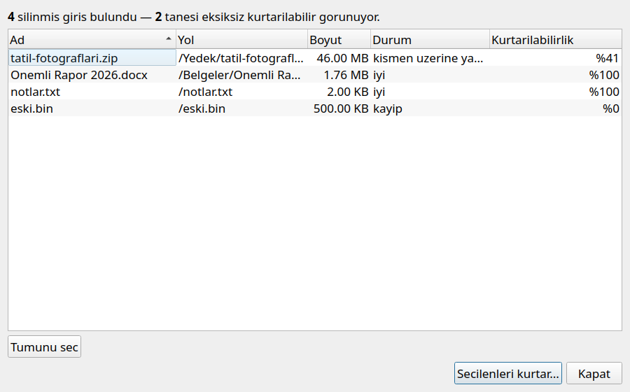 |
| UEFI önyükleme düzenleyici | Silinmiş dosya kurtarma |
| 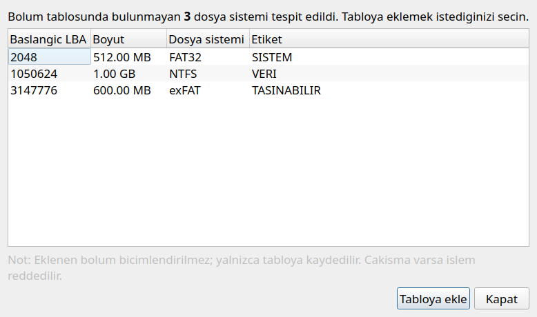 | 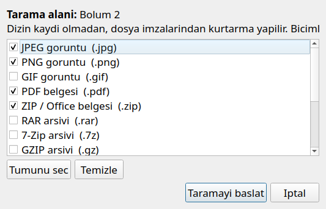 |
| Kayıp bölüm tarama | İmza tabanlı dosya kurtarma |
| 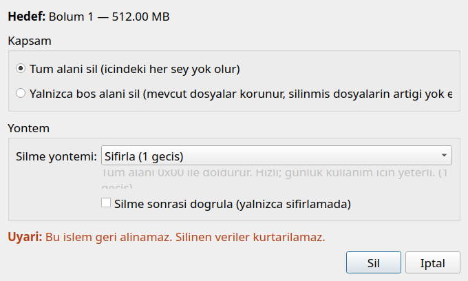 | 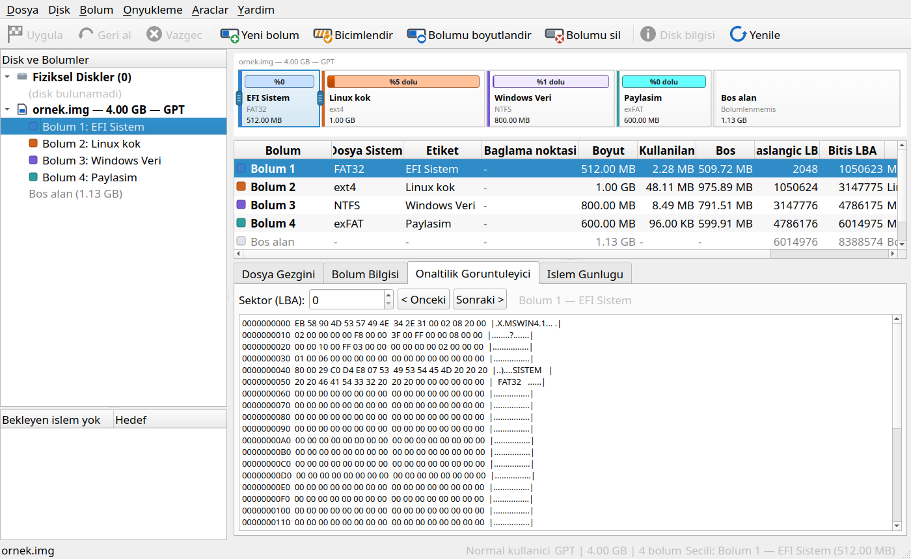 |
| Güvenli silme | Sektör onaltılık görüntüleyici |

## Kullanım

```bash
python3 main.py                  # boş başlat
python3 main.py disk.img         # açılışta bir görüntü aç
python3 main.py --no-root        # root / yönetici yetkisi sorma
DISKULTIMATE_LANG=en python3 main.py   # dili zorla (tr, en, de, fr, it, es, ru, zh, ja, ko)
DISKULTIMATE_THEME=dark python3 main.py  # temayı zorla (system, light, dark)
```

Aynı seçenekler `DiskUltimate.exe` ile de çalışır.

**Tipik akış:** *Dosya → Yeni goruntu...* (boyut ve bölüm tablosunu seçin) →
haritada boş alana sağ tıklayın → *Yeni bolum...* → dosya sistemini seçin →
*Dosya Gezgini* sekmesinden dosya ekleyin → **Uygula**.

**Açılışta dil sırası:** `DISKULTIMATE_LANG` → kayıtlı seçim → işletim
sisteminin dili → Türkçe.

**Windows bölümü Linux'ta bağlanmıyor mu?** Büyük olasılıkla Windows onu
"kirli" bıraktı (Hızlı başlatma varsayılan olarak açıktır). Bölümü seçip
*Bolum → NTFS'i denetle ve onar...* ve ardından **Uygula** kullanın. Tekrar
olmaması için Windows'ta Hızlı başlatmayı kapatın (*Denetim Masası → Güç
Seçenekleri → Güç düğmelerinin yapacaklarını seçin*) ya da Windows'u
**Yeniden başlat** ile kapatın.

**Wayland:** Qt 5'in yerel Wayland eklentisinde modal pencereler boş çizildiği
için uygulama Wayland oturumlarında kendiliğinden XWayland (`xcb`) üzerinde
açılır. Yerel Wayland'ı zorlamak için: `DISKULTIMATE_QPA=wayland python3 main.py`.

## Güvenlik

Fiziksel disk erişimi altı katmandan geçer ve bunların hiçbiri gevşetilmez:

1. **Listeleme zararsızdır** — diskler listelenirken hiçbir sektör okunmaz,
   hiçbir şey yazılmaz.
2. **Varsayılan salt okunur** — disk her zaman salt okunur açılır; yazma
   yetkisi yalnızca bekleyen adımlar uygulanırken alınır.
3. **Sistem diski** — çalışan sistemin bulunduğu diske yazmak için diskin adını
   yazarak onay vermek gerekir.
4. **Bilgisi eksik disk** (örneğin okuma yetkisi yok) — yazma **reddedilir**;
   "bilinmiyor" hiçbir zaman "güvenli" gibi gösterilmez.
5. **Bağlı bölüm** — bir şey yazılmadan önce ayrıca uyarılırsınız.
6. Her yeni yıkıcı işlemin bu katmanlardan geçtiği **test edilir**.

Başarısız bir biçimlendirme eski bölüm tablosunu geri yükler. Disk
görüntüleri hiçbir zaman yönetici yetkisi gerektirmez.

## Bilinen sınırlar

- **Beta:** gerçek disk işlemleri Windows ve Linux test makinelerinde
  sınanmıştır, ancak her donanım ve yapılandırmada değil.
- macOS sınanmamıştır ve desteklenmez.
- Onaltılık görüntüleyici salt okunurdur (sektör düzenleme yok).
- Henüz yok: bölüm bölme / birleştirme, birincil ↔ mantıksal dönüşümü, bozuk
  sektör taraması, S.M.A.R.T., dinamik diskler, RAID kurtarma.
- Silinmiş dosya kurtarma FAT ve exFAT'ta çalışır; diğer dosya sistemlerinde
  imza tabanlı kurtarmayı kullanın.

## Derleme ve test

PyInstaller ile tek dosyalık çalıştırılabilir üretmek için (bütün ayarlar
`DiskUltimate.spec` içindedir):

```bat
build_exe.bat        :: Windows → dist\DiskUltimate.exe
```
```bash
./build_appimage.sh  # Linux → dist/DiskUltimate-<sürüm>-x86_64.AppImage
```

AppImage taşınabilir bir Python (manylinux2014, glibc 2.17) ve PyPI'deki PyQt5
paketleriyle kurulur; sonuç derleme makinesinin glibc sürümüne bağlı değildir,
araç paketin gerektirdiği en yüksek glibc sürümünü yazar. `./build_linux.sh`
hâlâ tek dosyalık PyInstaller ikilisi üretir; ancak o, yalnızca derlendiği
makineninkiyle aynı veya daha yeni glibc'ye sahip sistemlerde çalışır.

Testler yalnızca disk görüntüsü dosyalarında çalışır (gerçek disklerinize
dokunulmaz):

```bash
python3 -m tests.run_all          # çekirdek testleri
python3 -m tests.platform_check   # çapraz platform kuralları
python3 -m tests.i18n_check       # çeviri sözlükleri
python3 -m tests.diag_check       # tanılama / donma yakalayıcı
python3 -m tests.ui_smoke         # arayüz duman testi
```

Uygulamanın yazdığı birimler bağımsız araçlarla çapraz doğrulanır
(`fsck.vfat`, `fsck.exfat`, `e2fsck`, `ntfsfix`, `xfs_repair`, `fsck.hfsplus`,
Windows `chkdsk`). Çeviriler `src/diskultimate/i18n/catalogs/*.ts` (Qt Linguist biçimi)
dosyalarındadır; Qt Linguist ile düzenlenebilir.

README ekran görüntüleri `python3 tools/readme_screenshots.py` ile yeniden
üretilir.

## Lisans

[GNU Genel Kamu Lisansı v3.0](LICENSE) — bu yazılımı kullanabilir, değiştirebilir
ve dağıtabilirsiniz; türetilen çalışmalar da aynı lisansla açık kaynak kalmak
zorundadır. İndirilebilir sürümler Qt (LGPL-3.0), PyQt5 (GPL-3.0), PyQt5-sip
(BSD-2-Clause), Python (PSF) ve gömülü ikon setlerini içerir; lisansları ve
bildirimleri *Yardım → Üçüncü taraf lisansları* altında listelenir
(`src/diskultimate/licenses/`).

Geliştirici: **Mikail Cansız** — https://github.com/mcansiz/DiskUltimate
